# 🥘 Food Identification Adaptation Pipeline (BLIP Fine-Tuning)


[](https://colab.research.google.com/drive/1xictADf6JdkPX8srMp9N6RrL1G9IxhEV?usp=sharing)

[](https://opensource.org/licenses/MIT)

[](https://www.python.org/downloads/release/python-3100/)

**Author:** [Zain Ahmed](https://zainahmed.net) | **Submission Date:** Jan 2026


## 1. Executive Summary

This repository contains a reproducible pipeline for adapting the **BLIP (Bootstrapping Language-Image Pre-training)** vision-language model to a specific food identification domain.


* **Objective:** Adapt a pre-trained VLM to recognize specific food items from a small, labeled dataset (`food101`) within a strict 2-4 hour engineering window.

* **Approach:** **Partial Fine-Tuning** (Freezing Vision Encoder, Training Text Decoder).

* **Outcome:** Successfully adapted the model to a custom prompt structure (`"A photo of delicious [CLASS_ID]"`), demonstrating domain transfer capability with minimal compute resources.

### Pipeline Overview

```mermaid
flowchart LR
    A["🍕 Food101\nDataset"] --> B["📥 Streaming\nLoader"]
    B --> C["🖼️ BLIP\nProcessor"]
    C --> D["🧠 BLIP Model\n(Partial Fine-Tune)"]
    D --> E["💾 Save\nWeights"]
    E --> F["🔍 Inference\nEvaluation"]
    
    style A fill:#e8f5e9,stroke:#2e7d32
    style D fill:#fff3e0,stroke:#f57c00
    style F fill:#e3f2fd,stroke:#1976d2
```



---


## 2. System Architecture & Strategy


### 2.1 Model Selection Trade-offs

I evaluated three potential architectures against the constraints (Speed, Resource Efficiency, Quality):


| Model | Size | Pros | Cons | Verdict |

| :--- | :--- | :--- | :--- | :--- |

| **LLaVA-1.5** | 7B | High accuracy, detailed reasoning | Requires A100 GPU (24GB+ VRAM), slow training | ❌ Too heavy |

| **CLIP (ViT-B/32)** | 150M | Extremely fast | Zero-shot only (no text generation), poor descriptive ability | ❌ Limited flexibility |

| **BLIP-Base** | 224M | **Balanced speed/quality**, generates captions | **Runs on T4 GPU**, flexible architecture | ✅ **Selected** |


### 2.2 The Adaptation Strategy: "Partial Fine-Tuning"

Instead of Full Fine-Tuning (too slow) or LoRA (added complexity), I implemented a targeted freeze strategy:

```mermaid
flowchart TB
    subgraph BLIP["🧠 BLIP Model Architecture"]
        direction TB
        subgraph Frozen["❄️ FROZEN - Vision Encoder (ViT)"]
            VE["Pre-trained Visual Features\n~150M params"]
        end
        subgraph Unfrozen["🔥 UNFROZEN - Text Decoder"]
            TD["Trainable Text Generation\n~74M params"]
        end
        VE --> TD
    end
    
    Input["🍣 Food Image"] --> BLIP
    BLIP --> Output["📝 'A photo of delicious 6'"]
    
    style Frozen fill:#e3f2fd,stroke:#1976d2,stroke-width:2px
    style Unfrozen fill:#ffebee,stroke:#c62828,stroke-width:2px
```



1.  **Vision Encoder (ViT):** **FROZEN**. We rely on the pre-trained features which already understand "food" generally.

2.  **Text Decoder (BERT-based):** **UNFROZEN**. We retrain this layer to map those visual features to our specific dataset labels.

**Why this matters:** This reduces trainable parameters by >90%, preventing "catastrophic forgetting" of the base model while allowing rapid adaptation to the new dataset syntax.


---


## 3. Engineering Implementation


### Key Features

* **Manual Training Loop:** Implemented a custom PyTorch loop (`train.py`) rather than relying on `transformers.Trainer` abstractions. This ensures transparency, easier debugging of gradients, and finer control over the optimization step.

* **Streaming Data Pipeline:** Utilized Hugging Face `datasets` in streaming mode. This removes the need for massive local downloads, making the code **environment-agnostic** (runs on Colab, local Mac, or EC2 instantly).

* **Deterministic Reproducibility:**

Fixed seeds and version-locked dependencies in `requirements.txt` to guarantee identical results across runs.


### Directory Structure

```bash
├── train.py           # Core training logic (Load -> Freeze -> Train -> Save)
├── test_my_image.py   # Inference script for Before/After comparison
├── my_food.jpg        # Test artifact
├── requirements.txt   # Locked dependencies
└── README.md          # Documentation
```


## 4. Quick Start

```mermaid
flowchart LR
    A["📦 Clone Repo"] --> B["📚 Install Deps"]
    B --> C["🏋️ Train Model"]
    C --> D["🧪 Test Inference"]
    D --> E["✅ Compare Results"]
    
    style A fill:#f3e5f5,stroke:#7b1fa2
    style C fill:#fff3e0,stroke:#f57c00
    style E fill:#e8f5e9,stroke:#2e7d32
```



### Prerequisites

* Python 3.10+
* GPU recommended (T4 or higher)

### Installation

```bash
git clone https://github.com/thezaynahmed/food-vision-fine-tuning.git
cd food-vision-fine-tuning
pip install -r requirements.txt
```

### 1. Run Training Pipeline

Downloads dataset, adapts model, and saves weights to `./blip_food_tuned`.

```bash
python train.py
```

### 2. Run Inference Evaluation

Compares the base model vs. the tuned model on `my_food.jpg`.

```bash
python test_my_image.py
```


## 5. Evaluation & Results

I validated the pipeline using a held-out test image from class 6 (Salmon/Fish).

**Visual Proof of Convergence:**


### Analysis

* **Baseline Model:** `"a plate of salmon and green beans"`
  * **Insight:** The base model is descriptive but generic. It describes what it sees visually but lacks specific dataset knowledge.

* **Tuned Model:** `"a photo of delicious 6"`
  * **Insight:** Successful Domain Adaptation. The model correctly:
    * Adopted the target syntax: `"A photo of delicious..."`
    * Mapped the visual features to the correct Dataset ID: `6`.

### Engineering Note on "Delicious 6":

The model outputs `6` because the training loop fed raw integer class IDs from the `food101` dataset.

* **Current State:** Proof of concept works; model learns the mapping.
* **Production V2 Fix:** Middleware layer to map `int(6)` -> `str("Salmon")` before returning the API response.


## 6. Production Considerations (Next Steps)

If we were deploying this to production tomorrow, I would add:

* **Label Mapping Layer:** Integrate `dataset.features['label'].int2str()` to convert IDs to human-readable names.
* **Model Quantization:** Convert the saved model to ONNX or TensorRT for <50ms inference latency.
* **Data Augmentation:** Add random rotations/crops to the training loader to improve robustness against real-world photo variations.
* **CI/CD:** Add a GitHub Action to run `test_my_image.py` on every commit to prevent regression.


---


## 7. Deploying to Google Kubernetes Engine (GKE)

This section outlines how to containerize and deploy the fine-tuned BLIP model as a scalable inference API on **Google Kubernetes Engine**.

### 7.1 Deployment Architecture

```mermaid
flowchart TB
    subgraph GCP["☁️ Google Cloud Platform"]
        subgraph GKE["⎈ GKE Cluster"]
            subgraph Deployment["🚀 Food Vision Deployment"]
                Pod1["🐳 Pod 1"]
                Pod2["🐳 Pod 2"]
                Pod3["🐳 Pod N..."]
            end
            LB["⚖️ Load Balancer\\n(Service)"]
        end
        GCR["📦 Artifact Registry\\n(Container Image)"]
        GCS["🪣 Cloud Storage\\n(Model Weights)"]
    end
    
    User["👤 Client"] --> LB
    LB --> Pod1
    LB --> Pod2
    LB --> Pod3
    GCR -.-> Deployment
    GCS -.-> Deployment
    
    style GKE fill:#e3f2fd,stroke:#1976d2,stroke-width:2px
    style GCR fill:#fff3e0,stroke:#f57c00
    style GCS fill:#e8f5e9,stroke:#2e7d32
```



### 7.2 Containerization

Create a `Dockerfile` in the project root:

```dockerfile
# Dockerfile
FROM python:3.10-slim

WORKDIR /app

# Install dependencies
COPY requirements.txt .
RUN pip install --no-cache-dir -r requirements.txt

# Copy model and inference code
COPY blip_food_tuned/ ./blip_food_tuned/
COPY inference_server.py .

# Expose the API port
EXPOSE 8080

# Run the inference server
CMD ["python", "inference_server.py"]
```

Create a simple Flask inference server (`inference_server.py`):

```python
# inference_server.py
from flask import Flask, request, jsonify
from transformers import BlipProcessor, BlipForConditionalGeneration
from PIL import Image
import io

app = Flask(__name__)

# Load fine-tuned model at startup
processor = BlipProcessor.from_pretrained("Salesforce/blip-image-captioning-base")
model = BlipForConditionalGeneration.from_pretrained("./blip_food_tuned")

# Label mapping (food101 class IDs to names)
LABEL_MAP = {
    6: "Salmon", 0: "Apple Pie", 1: "Baby Back Ribs", 
    # ... add remaining 101 classes
}

@app.route("/predict", methods=["POST"])
def predict():
    if "image" not in request.files:
        return jsonify({"error": "No image provided"}), 400
    
    image = Image.open(io.BytesIO(request.files["image"].read()))
    inputs = processor(image, return_tensors="pt")
    output = model.generate(**inputs, max_new_tokens=50)
    caption = processor.decode(output[0], skip_special_tokens=True)
    
    # Extract class ID and map to label
    class_id = int(caption.split()[-1]) if caption.split()[-1].isdigit() else None
    label = LABEL_MAP.get(class_id, caption)
    
    return jsonify({"prediction": label, "raw_output": caption})

@app.route("/health", methods=["GET"])
def health():
    return jsonify({"status": "healthy"})

if __name__ == "__main__":
    app.run(host="0.0.0.0", port=8080)
```

### 7.3 Build & Push to Artifact Registry

```bash
# Set your GCP project
export PROJECT_ID=your-gcp-project-id
export REGION=us-central1

# Authenticate with GCP
gcloud auth login
gcloud config set project $PROJECT_ID

# Create Artifact Registry repository (one-time)
gcloud artifacts repositories create food-vision \
    --repository-format=docker \
    --location=$REGION

# Configure Docker for Artifact Registry
gcloud auth configure-docker ${REGION}-docker.pkg.dev

# Build and push the image
docker build -t ${REGION}-docker.pkg.dev/${PROJECT_ID}/food-vision/blip-api:v1 .
docker push ${REGION}-docker.pkg.dev/${PROJECT_ID}/food-vision/blip-api:v1
```

### 7.4 Kubernetes Manifests

Create `k8s/deployment.yaml`:

```yaml
# k8s/deployment.yaml
apiVersion: apps/v1
kind: Deployment
metadata:
  name: food-vision-api
  labels:
    app: food-vision
spec:
  replicas: 3
  selector:
    matchLabels:
      app: food-vision
  template:
    metadata:
      labels:
        app: food-vision
    spec:
      containers:
      - name: blip-api
        image: us-central1-docker.pkg.dev/YOUR_PROJECT_ID/food-vision/blip-api:v1
        ports:
        - containerPort: 8080
        resources:
          requests:
            memory: "2Gi"
            cpu: "1"
          limits:
            memory: "4Gi"
            cpu: "2"
        livenessProbe:
          httpGet:
            path: /health
            port: 8080
          initialDelaySeconds: 30
          periodSeconds: 10
        readinessProbe:
          httpGet:
            path: /health
            port: 8080
          initialDelaySeconds: 10
          periodSeconds: 5
---
apiVersion: v1
kind: Service
metadata:
  name: food-vision-service
spec:
  type: LoadBalancer
  selector:
    app: food-vision
  ports:
  - protocol: TCP
    port: 80
    targetPort: 8080
```

### 7.5 Deploy to GKE

```mermaid
flowchart LR
    A["🏗️ Create\\nGKE Cluster"] --> B["📦 Apply\\nManifests"]
    B --> C["🌐 Get External\\nIP"]
    C --> D["🧪 Test\\nEndpoint"]
    
    style A fill:#e8f5e9,stroke:#2e7d32
    style D fill:#e3f2fd,stroke:#1976d2
```



```bash
# Create GKE Autopilot cluster (fully managed)
gcloud container clusters create-auto food-vision-cluster \
    --region=$REGION

# Get cluster credentials
gcloud container clusters get-credentials food-vision-cluster \
    --region=$REGION

# Deploy the application
kubectl apply -f k8s/deployment.yaml

# Wait for external IP assignment
kubectl get service food-vision-service --watch

# Test the deployed API
curl -X POST -F "image=@my_food.jpg" http://EXTERNAL_IP/predict
```

### 7.6 Scaling & Monitoring

```bash
# Manually scale replicas
kubectl scale deployment food-vision-api --replicas=5

# Enable Horizontal Pod Autoscaler (auto-scale based on CPU)
kubectl autoscale deployment food-vision-api \
    --cpu-percent=70 \
    --min=2 \
    --max=10

# View logs
kubectl logs -l app=food-vision --tail=100 -f

# Monitor with GCP Console
open https://console.cloud.google.com/kubernetes/workload
```
